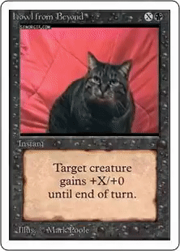

# Magic: The GIFening


A Twitter bot which tweets Magic: the Gathering cards with appropriate GIFs superimposed onto them. Made in Python using the [GIPHY API](https://developers.giphy.com) and [MoviePy](https://github.com/Zulko/moviepy). 

You can see the bot in action at [the Twitter account @MTGIFening](https://twitter.com/MTGIFening).

Some highlights:

* [Vendetta](https://twitter.com/MTGIFening/status/916902255277760514)
* [Sudden Shock](https://twitter.com/MTGIFening/status/913981726182981632)
* [Metamorphosis](https://twitter.com/MTGIFening/status/914012656167559168)

In order to tweet on a regular schedule, the Dockerfile contains a cronjob which runs the script at the specified interval of time (currently set at 4 times a day/every 6 hours).

## Usage

First, create a `secrets.py` with the appropriate GIPHY and Twitter API Keys:

```
GIPHY_API_KEY = '<FILL IN>'
CONSUMER_KEY = '<FILL IN>'
CONSUMER_SECRET = '<FILL IN>'
ACCESS_KEY = '<FILL IN>'
ACCESS_SECRET = '<FILL IN>'
```

The current list of cards used to generate images is derived from `cards.csv`. If you want to update the list, use `get_cardlist.py` and the `AllSets.json` file from [MTG JSON](https://mtgjson.com).

Then run `mtgifening.py` and it should save and tweet a random GIF!

To run as a Twitter bot on the schedule, after you've added your `secrets.py` file, build the Docker container. Then run the container in detached mode, starting it up using `/sbin/my_init`:

```
docker run --rm -d magic /sbin/my_init
```

## Requirements
moviepy, ffmpeg, twython, Pillow

## Maintainer/Creator

Max Woolf ([@minimaxir](http://minimaxir.com))

*Max's open-source projects are supported by his [Patreon](https://www.patreon.com/minimaxir). If you found this project helpful, any monetary contributions to the Patreon are appreciated and will be put to good creative use.*

## License
MIT